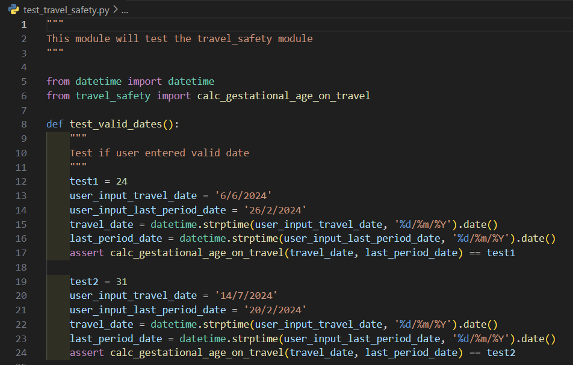

# Terminal Application

## Term 1, Assignment 3

Web Development Accelerated
Coder Academy

## Purpose

Welcome to my Python project developed to showcase my knowledge and skills on Python Programming at Coder Academy. This is part of Term 1 assignment by developing terminal application.

## About the Application

The name of my app is "Pregnancy Tracker".

This application was inspired by my wife's pregnancy journey, as she was 9 weeks pregnant when I initially submitted the idea for approval. 

The purpose of this app is to provide helpful information related to pregnancy such as calculating the gestational age, estimate due date, countdown until due date and many more. Please refer to the Features section below for details.

## Github Repository

You can find the Github repository for my terminal app in [https://github.com/jmcaluyafuentes/terminal-app-T1A3](https://github.com/jmcaluyafuentes/terminal-app-T1A3).

## Preview of the application

Upon running the app, the console displays something like the below image as a preview of the application.


## Development Plan

You can find the Trello board for my terminal app in [https://trello.com/b/qk7qA75c/t1a3-terminal-app](https://trello.com/b/qk7qA75c/t1a3-terminal-app).

Below is a snapshot of my Trello board during the initial stage of my terminal app development:


Below is a snapshot of the final stage:


The Trello board tool is very useful in organizing tasks, tracking progress, and managing the development process of my terminal app.

## Technology Stack

* Languages: Python 3 for the application logic and bash script for system-level interactions.  
* Project Type: Terminal application designed to run in a command-line interface (CLI).  
* IDE: Visual Studio Code (VS Code) used for writing code and debugging.  
* Version Control: Git for version and source control.  
* Repository Hosting: GitHub for hosting the Git repository remotely.  
* Package Manager: pip for managing Python packages and dependencies.  
* Operating System Compatibility: Developed for Microsoft Windows operating systems, utilizing the Windows Subsystem for Linux (WSL) for Linux compatibility.

## Code Styling Guide

* PEP8 Styling - guide and styling convention for writing code  
* PEP257 Styling - guide and styling convention for writing docstring

## Dependencies required by the application

#### Standard Library Modules

* sys: Provides access to system-specific parameters and functions.  
* textwrap: Offers convenient text wrapping and filling functionality.  
* datetime: Supports date and time manipulation and formatting.  
* csv: Facilitates reading and writing CSV (Comma-Separated Values)   files.

#### Third-Party Packages

* Colorama (version 0.4.6): Provides cross-platform colored terminal text.  
* Emoji (version 2.11.1): Allows easy usage of emoji characters in Python.  
* Pytest (version 8.2.0): A testing framework for Python projects.  

#### Pytest Dependencies (installed automatically with pytest)

* exceptiongroup (version 1.2.1)  
* iniconfig (version 2.0.0)  
* packaging (version 24.0)  
* pluggy (version 1.5.0)  
* tomli (version 2.0.1)  

## System and hardware requirements

### Prerequisites

* Make sure you have the latest version of Windows 10 or later.
* Enable the Windows Subsystem for Linux (WSL) on your Windows system.

#### Step 1: Install Windows 10

Install Windows 10 into your laptop or desktop. Check the latest version here https://learn.microsoft.com/en-us/windows/release-health/.

#### Step 2: Install Windows Terminal

Install Windows Terminal from Microsoft Store here https://apps.microsoft.com/detail/9n0dx20hk701?rtc=1&hl=en-au&gl=AU.

#### Step 3. Install Ubuntu 22.04 WSL

"Windows Subsystem For Linux (WSL) is a technology built into Windows that allows running a Linux operating system within it's own environment or container, side-by-side with Windows. This gives us the best of both worlds. (source: Coder Academy)"

1. Go to https://learn.microsoft.com/en-us/windows/wsl/install.

    Pre-requisite: You must be running Windows 10 version 2004 and higher.

2. Install WSL command

    "Open PowerShell or Windows Command Prompt in administrator mode by right-clicking and selecting "Run as administrator", enter the wsl --install command, then restart your machine. (source: Microsoft)"

    In Powershell:

    ```
    wsl --install
    ```

3. Check the version of your Ubuntu

    ```
    lsb_release -rs
    ```

### Check your Python version

Guide is available here https://learn.microsoft.com/en-us/windows/python/web-frameworks#install-python-pip-and-venv.

"Ubuntu 18.04 LTS comes with Python 3.6 already installed, but it does not come with some of the modules that you may expect to get with other Python installations. We will still need to install pip, the standard package manager for Python, and venv, the standard module used to create and manage lightweight virtual environments. (source: Microsoft)"

#### Step 1. Open your Ubuntu terminal

Search 'Ubuntu' and click to open the terminal.

#### Step 2. You must have a Python3 version

1. Confirm if you already have Python3 by typing the command below and hit enter.

    ```
    python3 --version
    ```

    This should return your Python version number such as 3.12.10

2. Update your version in Python

    If you need to update your version of Python, first update your Ubuntu version by entering:

    ```
    sudo apt update && sudo apt upgrade
    ```

    Then update Python using:

    ```
    sudo apt upgrade python3
    ```

#### Step 3. Install pip

1. Enter the command below.

    ```
    sudo apt install python3-pip
    ```

2. Pip allows you to install and manage additional packages that are not part of the Python standard library.

## How to Install the Application

#### Step 1. Open the directory in your laptop or desktop

1. Open your Ubuntu terminal

2. Check your current directory

    ```
    pwd
    ```

3. Navigate to the directory where you want to install the Pregnancy Tracker app.

    ```
    cd ./path-to-your-folder
    ```

    Replace the 'path-to-your-folder' with the actual path of your directory.

#### Step 2. Clone my repository

1. Copy and paste below command into your terminal

    ```
    git clone git@github.com:jmcaluyafuentes/terminal-app-T1A3.git
    ```

#### Step 3. Run the Pregnancy Tracker app

1. Navigate to the project directory

    ```
    cd terminal-app-T1A3
    ```

2. Change the permission of the script file run_app.sh

    ```
    chmod +x run_app.sh 
    ```

3. Run the application by typing this command

    ```
    ./run_app.sh
    ```

    * This command will automatically install a virtual environment into your selected directory so that all packages in this app will not be installed to the global environment.

    * The command also automatically installs all dependencies (i.e., third-party packages) necessary to run the app as intended.

    * Lastly, the command will run the application.

#### Step 4. How to exit the app

1. To exit the app at anytime, type "QUIT" (case-insensitive) and press enter.  

2. Alternatively, you can use the 'CTRL + C' in your keyboard.

## Features of the Application

### 1. Pregnancy Information

Input: Date of last menstrual period entered by the user

Outputs:

a. Number of Weeks Pregnant: Calculates and displays the number of weeks pregnant based on the input date.

b. Trimester Information: Indicates whether the user is in her 1st, 2nd, or 3rd trimester of pregnancy.

c. Estimated Due Date: Provides an estimated due date based on the input date.

d. Countdown: Displays a countdown (in weeks and days) from current date to the estimated due date.

#### Run the app by entering the command "./run_app.sh" in the terminal. 

Please take note that every time you enter a command, hit enter so that the app can execute the command.


Select 1 for Pregnancy Information:


Enter the date of last menstrual period:


Then the app will display the pregnancy information:


Select 2 to go back to main menu.

### 2. Safety Information

In the early stage of development, this feature was previously named 'Precaution'.

However, I realized that the appropriate title is "Safety Information" because it encompasses a broader scope of ensuring the well-being and health safety of the pregnant user.

From the main menu, select 2 for Safety Information:


### Sub-features:

#### 2.1 Food Safety Information

Input: Specific food item (e.g., Grapes) entered by the user

Output:

Determines whether the food is "Safe to Eat", "Not Safe to Eat" or other information relevant to food safety.

Select 1 for Food Safety:


Enter the food:


The app will display the food safety information:


Select 2 to go back to Safety Information menu.

#### 2.2 Travel Safety Information

Input: Planned travel date and last menstrual period date entered by the user.

Outputs:

a. Estimated Weeks Pregnant on Travel Date: Calculates and displays the estimated number of weeks pregnant on the planned travel date.

b. Safety Advice: Provides tailored advice related to the planned travel, such as:
Whether it's safe to travel internationally.
Recommendations such as obtaining a medical certificate or precautions at airport security.
Activity Safety
This feature ensures that the user is aware of safe and appropriate activities during pregnancy.

Select 2 for the Travel Safety:


Enter the last date of menstrual period:


Enter the planned travel date:


Select from the given questions related to travel safety:


The app will display the travel safety information related to the question you selected:


Select 2 to go back to Safety Information menu.

#### 3. Note-taking

Input: User-generated personal notes (e.g., milestone events, feelings).

Outputs:

a. Recording Notes: Notes are saved to a file, including the current date and time of entry.

b. Confirmation Message: The app confirms successful addition of the note to the file.

c. Viewing Recorded Notes: Users can view all past notes, providing a log of their pregnancy journey.

Select 3 for the note-taking:


Select 1 to write your personal notes:


Now, write your notes:


The app will confirm the note was successfully recorded:


Select 2 to go back to one menu up.

Then, select 2 to read your recorded note:


The app will display your recorded notes.


#### Guide to display the detailed instructions or exit the app

1. You can enter "INSTRUCTIONS" (case-insensitive) at any time in order to display the instructions. Enter "CLOSE" (case-insensitive) to close the instruction page.


The app will then display the instructions.


2. You can enter "QUIT" (case-insensitive) at any time to exit the app.

## Error Handling

### Invalid selection entered

If invalid selection number is entered, the app will display an error.


### Invalid date or format

If invalid date or format is entered, the app will display an error.


### Last menstrual period date is greater than the current date (this is invalid)

If the last menstrual period date is greater than the current date, the app will display an error.


### Travel date is less than the current date (this is invalid)

If travel date is less than the current date, the app will display an error.


### Safety information of food entered is not available

If safety information of food entered is not available, the app will display an error.


### Unit Testing

The date entered by the user is tested if valid using the pytest package.



## Logic of functions

### Main function

```py
while True:
            # Give user options based on the features of this app
            print(dedent('''
            Select from the following features.\n
            1. Pregnancy Information
            2. Safety Information
            3. Take Down Notes
            '''))

            # Prompt the user of her choice
            user_choice = input('Enter your choice (1, 2 or 3): ')

            # Check if user want to view the instructions or exits the app
            instructions = guide_user_response(user_choice)

            while not instructions:
                # Check what option the user selected
                if user_choice == '1':
                    # Display pregnancy information based on user input
                    pregnancy_information()
                    display_guide_on_top() # From print_guide module
                elif user_choice == '2':
                    # Display safety information based on user input
                    safety_info()
                    display_guide_on_top() # From print_guide module
                elif user_choice == '3':
                    # Record user's personal notes
                    note_taking()
                    display_guide_on_top() # From print_guide module
                else:
                    # Display the guide for instructions and for quitting the app
                    display_guide_on_top() # From print_guide module

                    # Inform the user if she entered invalid choice
                    print(Fore.RED + emoji.emojize(f':cross_mark: ERROR: "{user_choice}" is an invalid choice. Please enter 1, 2 or 3.') + Style.RESET_ALL)
                instructions = True
    # Exit the app if there are keyboard interrupt done by the user such 'Ctrl + C'
    except KeyboardInterrupt:
        print('\n' * 200)
        print(Fore.RED + emoji.emojize('\n:cross_mark: ERROR: Keyboard interrupt received.\n') + Style.RESET_ALL)
        print(Fore.GREEN + 'Thank you for using the Pregnancy Tracker app. Goodbye!\n' + Style.RESET_ALL)
        sys.exit(1)
```

### Explanation:

#### Outer while True Loop:

This loop runs indefinitely until explicitly terminated by a keyboard interrupt (Ctrl + C).

#### User Interface:

The program displays a menu of features for the user to choose from.  
It prompts the user to enter their choice (1, 2, or 3) via the input function.

#### Processing User Input:

The program calls the guide_user_response function to check if the user wants to view instructions or exit the app.

#### Inner while not instructions Loop:

This loop executes as long as the instructions flag is False, indicating normal feature selection.

#### Feature Handling:

Depending on the user's choice (1, 2, or 3), the program executes different functions:

If user_choice is '1', it displays pregnancy information after calling the pregnancy_information() function.

If user_choice is '2', it displays safety information after calling the safety_info() function.

If user_choice is '3', it allows the user to take personal notes by calling the note_taking() function.

#### Error Handling:

If the user enters an invalid choice (i.e., not '1', '2', or '3'), it displays an error message.

The program then exits the inner loop by setting instructions to True.

#### Keyboard Interrupt Handling:

The program handles a KeyboardInterrupt exception (Ctrl + C) by displaying an error message and exiting gracefully.

#### pregnancy_information function

```py
def pregnancy_information() -> None:
    """
    Calculate and display the information about pregnancy such as gestational age 
    in weeks, trimester, estimated due date (EDD) and countdown until EDD.
    """
    while True:
        # Prompt the user to enter the date of her last menstrual period
        last_period_date = get_last_period_date()

        # Calculate gestational age in weeks
        gestational_age, trimester, due_date, weeks_remaining, days_remaining = calc_pregnancy_info(last_period_date)

        # Display the guide for instructions and for quitting the app
        display_guide_on_top() # From print_guide module

        # Display relevant information about the pregnancy
        print(Fore.YELLOW + emoji.emojize(dedent(f'''
            Pregnancy Information:\n
            You are {gestational_age} weeks pregnant :baby: \n
            Trimester: {trimester}
            Estimated Due Date: {due_date.strftime('%d/%m/%Y')}
            Due Date Countdown: {weeks_remaining} week(s) and {days_remaining} days.
            ''') + Style.RESET_ALL))

        # Prompt user what she wants to do next
        if not get_user_next_action(): # From user_next_action module

            # Display the guide for instructions and for quitting the app
            display_guide_on_top() # From print_guide module
            break # Return to main menu based on user choice
```

### Explanation:

#### User Input for Last Menstrual Period:

The function starts by calling get_last_period_date() to prompt the user to enter the date of her last menstrual period and obtain the last_period_date as a datetime.date object.

#### Calculating Pregnancy Information:

It then calls calc_pregnancy_info function to compute essential pregnancy information based on the last_period_date. This function calculates:

* gestational_age: The number of weeks since the last menstrual period.
* trimester: Determines whether the pregnancy is in the first, second, or third trimester based on gestational_age.
* due_date: Estimated due date (EDD) based on the last_period_date.
* weeks_remaining and days_remaining: Countdown until the estimated due date (due_date).

#### Displaying Pregnancy Information:

The function then displays the calculated pregnancy information using formatted text and emojis, including:

* gestational_age in weeks.
* trimester.
* due_date in DD/MM/YYYY format.
* Countdown (weeks_remaining and days_remaining) until the estimated due date.

#### Handling User Interaction:

After displaying the pregnancy information, it prompts the user for the next action using get_user_next_action().

If the user chooses to return to the main menu (by not taking any further action), the function breaks out of the loop and returns control to the main menu.

### get_last_period_date function

```py
def get_last_period_date() -> date:
    """
    Prompt user to enter the last menstrual period date and parse the input for validation.

    Returns:
        date: The parsed date object representing the last menstrual period date.

    """
    # Display the guide for instructions and for quitting the app
    display_guide_on_top() # From print_guide module

    while True:
        # Prompt user to enter the date of her last menstrual period
        user_input = input('\nEnter the date of your last menstrual period (DD/MM/YYYY): ')
        # Check if user want to view the instructions or exits the app
        instructions = guide_user_response(user_input)

        while not instructions:
            try:
                # Convert user input string into datetime.date object in DD/MM/YYYY format
                last_period_date = datetime.strptime(user_input, '%d/%m/%Y').date()
                # Get current date
                current_date = date.today()
                # Check if last_period_date is before the current date
                if last_period_date < current_date:
                    return last_period_date
                else:
                    # Display the guide for instructions and for quitting the app
                    display_guide_on_top() # From print_guide module
                    # Display error message for invalid input date
                    print(Fore.RED + emoji.emojize(dedent(f'''
                    :cross_mark: ERROR: The last menstrual period date {last_period_date} must be before the current date.
                    ''')) + Style.RESET_ALL)
                    instructions = True
            except ValueError:
                # Display the guide for instructions and for quitting the app
                display_guide_on_top() # From print_guide module
                # Handles error gracefully if user entered invalid date format
                print(Fore.RED + emoji.emojize(dedent(f'''
                :cross_mark: ERROR: "{user_input}" is an invalid format.
                Please enter the date in DD/MM/YYYY.'''
                )) + Style.RESET_ALL)
                instructions = True
```

### Explanation:

#### User Input Prompt:

The function starts by displaying a guide for the user and prompts them to enter the date of their last menstrual period (DD/MM/YYYY format) using the input() function.

#### Input Validation Loop:

The function enters a loop (while True) to continuously prompt the user for input until a valid date is provided.

#### Date Parsing and Validation:

Inside the loop, it attempts to convert the user's input string into a datetime.date object using datetime.strptime().

If the conversion succeeds (try block), it checks if the parsed last_period_date is before the current date (date.today()). If valid, it returns the parsed date.

If the input format is invalid or cannot be parsed (except ValueError block), it displays an error message and continues to prompt the user for a valid input.

#### Handling User Instructions:

The instructions flag controls whether to continue prompting the user (while not instructions) or allow the user to exit or view instructions based on their input.

#### Error Handling and Messaging:

If there's an error parsing the date or the date is invalid, appropriate error messages are displayed using colored text.

## References

The Royal Women's Hospital, Victoria Australia. "Food Safety During Pregnancy." Available at: https://thewomens.r.worldssl.net/images/uploads/fact-sheets/Food-safety-during-pregnancy.pdf

The Alphabetizer. "List of fruits and vegetables." Available at: https://alphabetizer.flap.tv/lists/list-of-fruits-and-vegetables.php

Better Health Channel. "Pregnancy and travel." Available at: https://www.betterhealth.vic.gov.au/health/healthyliving/pregnancy-and-travel

Greater Than. "10 Fun Activities for Pregnant Moms for All Stages of Your Pregnancy." Available at: https://drinkgt.com/blogs/news/activities-for-pregnant-moms

David Anson. Markdown lint MD007 - Unordered list indentation. Available at: https://github.com/DavidAnson/markdownlint/blob/v0.34.0/doc/md007.md

Colorama (version 0.4.6) package in 'pypi.org'. Available at: https://pypi.org/project/colorama/

Emoji (version 2.11.1) package in 'pypi.org'. Available at: https://pypi.org/project/emoji/

Pytest (version 8.2.0) package in 'pypi.org'. Available at: https://pypi.org/project/pytest/

Microsoft Website. How to install Linux on Windows with WSL. Available at: https://learn.microsoft.com/en-us/windows/wsl/install

Microsoft website. Get started using Python for web development on Windows. Available at: https://learn.microsoft.com/en-us/windows/python/web-frameworks#install-python-pip-and-venv


