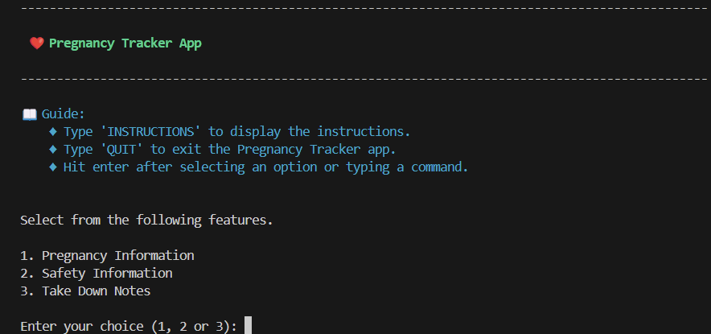

# Terminal Application

## Term 1, Assignment 3

Web Development Accelerated
Coder Academy

## Purpose

Welcome to my Python project developed to showcase my knowledge and skills on Python Programming at Coder Academy. This is part of Term 1 assignment by developing terminal application.

## About the Application

The name of my app is "Pregnancy Tracker".

This application was inspired by my wife's pregnancy journey, as she was 9 weeks pregnant when I initially submitted the idea for approval. 

The purpose of this app is to provide helpful information related to pregnancy such as calculating the gestational age, estimate due date, countdown until due date and many more. Please refer to the Features section below for details.

## Github Repository

You can find the Github repository for my terminal app in [https://github.com/jmcaluyafuentes/terminal-app-T1A3](https://github.com/jmcaluyafuentes/terminal-app-T1A3).

## Preview of the application

Upon running the app, the console displays something like the below image as a preview of the application.



## Development Plan

You can find the Trello board for my terminal app in [https://trello.com/b/qk7qA75c/t1a3-terminal-app](https://trello.com/b/qk7qA75c/t1a3-terminal-app).

Below is a snapshot of my Trello board during the initial stage of my terminal app development:


Below is a snapshot of the final stage:


The Trello board tool is very useful in organizing tasks, tracking progress, and managing the development process of my terminal app.

## Technology Stack

* Languages: Python 3 for the application logic and bash script for system-level interactions.  
* Project Type: Terminal application designed to run in a command-line interface (CLI).  
* IDE: Visual Studio Code (VS Code) used for writing code and debugging.  
* Version Control: Git for version and source control.  
* Repository Hosting: GitHub for hosting the Git repository remotely.  
* Package Manager: pip for managing Python packages and dependencies.  
* Operating System Compatibility: Developed for Microsoft Windows operating systems, utilizing the Windows Subsystem for Linux (WSL) for Linux compatibility.

## Code Styling Guide

* PEP8 Styling - guide and styling convention for writing code  
* PEP257 Styling - guide and styling convention for writing docstring

## Dependencies required by the application

#### Standard Library Modules

* sys: Provides access to system-specific parameters and functions.  
* textwrap: Offers convenient text wrapping and filling functionality.  
* datetime: Supports date and time manipulation and formatting.  
* csv: Facilitates reading and writing CSV (Comma-Separated Values)   files.

#### Third-Party Packages

* Colorama (version 0.4.6): Provides cross-platform colored terminal text.  
* Emoji (version 2.11.1): Allows easy usage of emoji characters in Python.  
* Pytest (version 8.2.0): A testing framework for Python projects.  

#### Pytest Dependencies (installed automatically with pytest)

* exceptiongroup (version 1.2.1)  
* iniconfig (version 2.0.0)  
* packaging (version 24.0)  
* pluggy (version 1.5.0)  
* tomli (version 2.0.1)  

## System and hardware requirements

### Prerequisites

* Make sure you have the latest version of Windows 10 or later.
* Enable the Windows Subsystem for Linux (WSL) on your Windows system.

#### Step 1: Install Windows 10

Install Windows 10 into your laptop or desktop. Check the latest version here https://learn.microsoft.com/en-us/windows/release-health/.

#### Step 2: Install Windows Terminal

Install Windows Terminal from Microsoft Store here https://apps.microsoft.com/detail/9n0dx20hk701?rtc=1&hl=en-au&gl=AU.

#### Step 3. Install Visual Studio Code (VS Code)

Install the VS Code from here https://code.visualstudio.com/download.

#### Step 4. Install Ubuntu 22.04 WSL

"Windows Subsystem For Linux (WSL) is a technology built into Windows that allows running a Linux operating system within it's own environment or container, side-by-side with Windows. This gives us the best of both worlds. (source: Coder Academy)"

1. Go to https://learn.microsoft.com/en-us/windows/wsl/install.

    Pre-requisite: You must be running Windows 10 version 2004 and higher.

2. Install WSL command

    "Open PowerShell or Windows Command Prompt in administrator mode by right-clicking and selecting "Run as administrator", enter the wsl --install command, then restart your machine. (source: Microsoft)"

    In Powershell:

    ```
    wsl --install
    ```

3. Check the version of your Ubuntu

    ```
    lsb_release -rs
    ```

### Check your Python version

Guide is available here https://learn.microsoft.com/en-us/windows/python/web-frameworks#install-python-pip-and-venv.

"Ubuntu 18.04 LTS comes with Python 3.6 already installed, but it does not come with some of the modules that you may expect to get with other Python installations. We will still need to install pip, the standard package manager for Python, and venv, the standard module used to create and manage lightweight virtual environments. (source: Microsoft)"

#### Step 1. Open your Ubuntu terminal

Search 'Ubuntu' and click to open.

#### Step 2. You must have a Python3 version

1. Confirm if you already have Python3 by typing the command below and hit enter.

    ```
    python3 --version
    ```

    This should return your Python version number such as 3.12.10

2. Update your version in Python

    If you need to update your version of Python, first update your Ubuntu version by entering:

    ```
    sudo apt update && sudo apt upgrade
    ```

    Then update Python using:

    ```
    sudo apt upgrade python3
    ```

#### Step 3. Install pip

1. Enter the command below.

    ```
    sudo apt install python3-pip
    ```

2. Pip allows you to install and manage additional packages that are not part of the Python standard library.

## How to Install the Application


## Features of the Application

### 1. Pregnancy Information

### 2. Safety Information

Changed the title from "Precautions" (based from the development plan) to "Safety Information" as latter is more appropriate for this context.

### 3. Note-taking

## Testing

## References

The Royal Women's Hospital, Victoria Australia. "Food Safety During Pregnancy." Available at: https://thewomens.r.worldssl.net/images/uploads/fact-sheets/Food-safety-during-pregnancy.pdf

The Alphabetizer. "List of fruits and vegetables." Available at: https://alphabetizer.flap.tv/lists/list-of-fruits-and-vegetables.php

Better Health Channel. "Pregnancy and travel." Available at: https://www.betterhealth.vic.gov.au/health/healthyliving/pregnancy-and-travel

Greater Than. "10 Fun Activities for Pregnant Moms for All Stages of Your Pregnancy." Available at: https://drinkgt.com/blogs/news/activities-for-pregnant-moms

David Anson. Markdown lint MD007 - Unordered list indentation. Available at: https://github.com/DavidAnson/markdownlint/blob/v0.34.0/doc/md007.md

Colorama (version 0.4.6) package in 'pypi.org'. Available at: https://pypi.org/project/colorama/

Emoji (version 2.11.1) package in 'pypi.org'. Available at: https://pypi.org/project/emoji/

Pytest (version 8.2.0) package in 'pypi.org'. Available at: https://pypi.org/project/pytest/

Microsoft Website. How to install Linux on Windows with WSL. Available at: https://learn.microsoft.com/en-us/windows/wsl/install

Microsoft website. Get started using Python for web development on Windows. Available at: https://learn.microsoft.com/en-us/windows/python/web-frameworks#install-python-pip-and-venv


